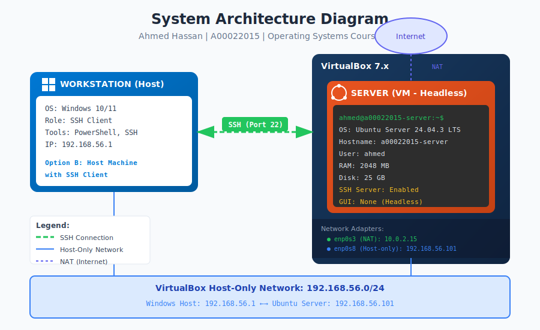
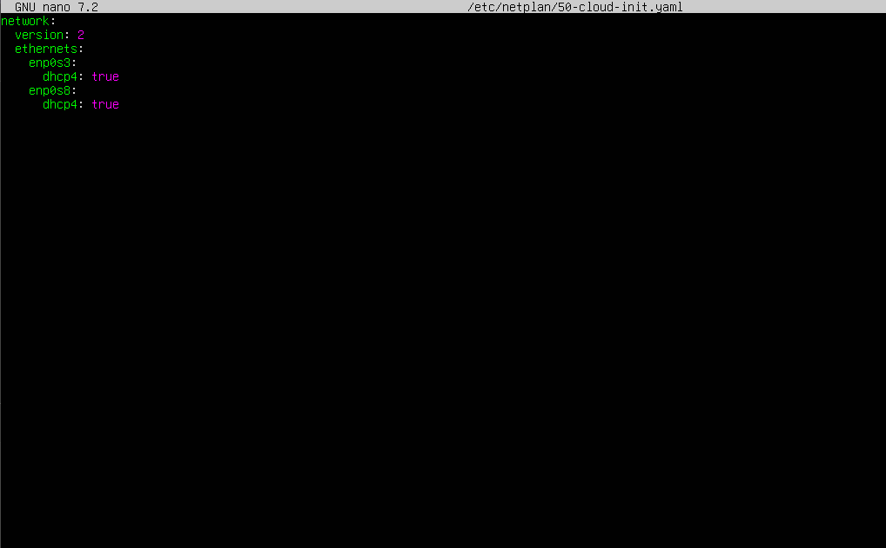
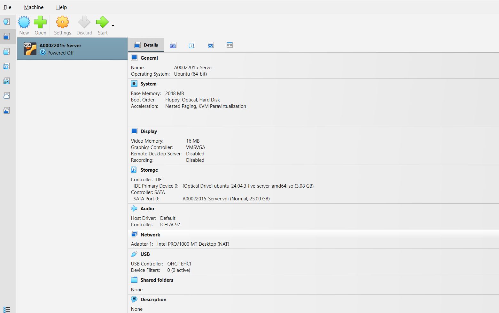
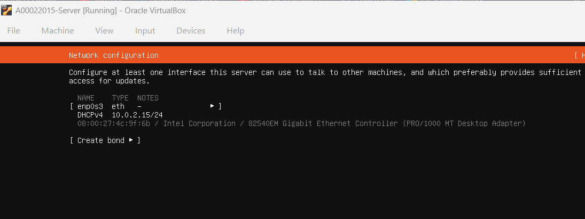
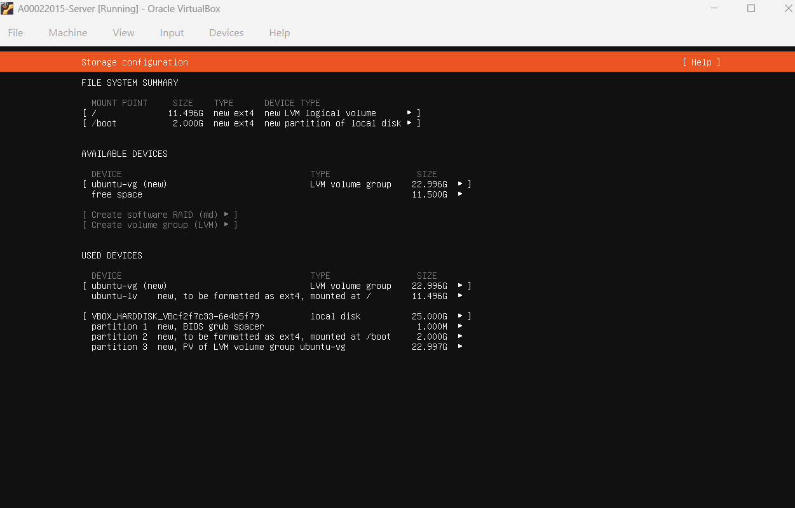
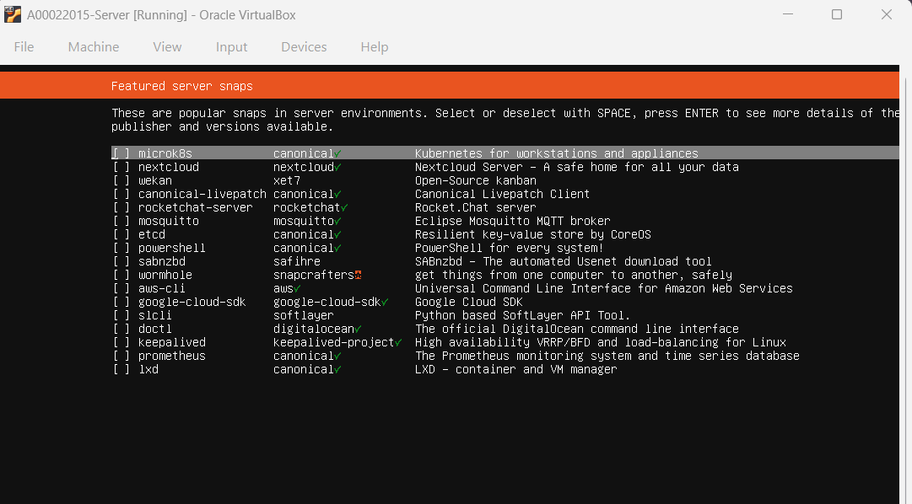
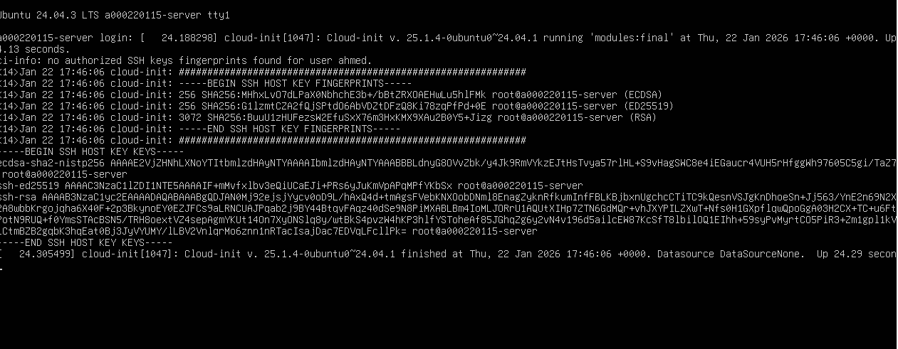
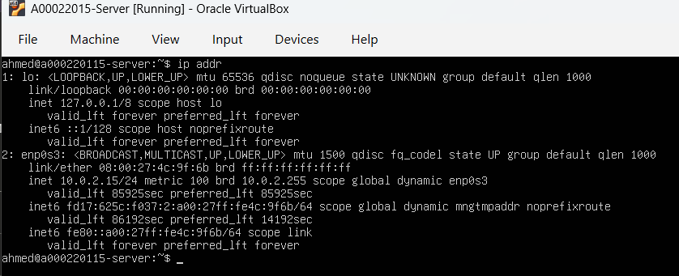
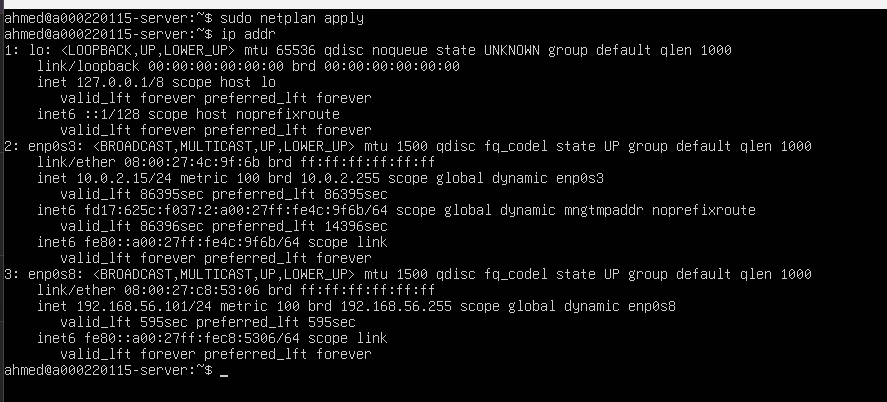
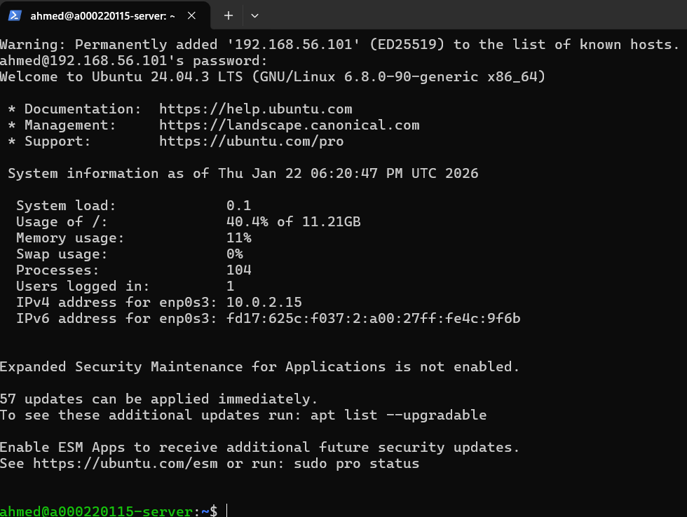

# Week 1: System Planning and Distribution Selection

**Student:** Ahmed Hassan | **Student ID:** A00022015 | **Module:** CMPN202 Operating Systems

---

## 1. System Architecture Diagram

| Component | Details |
|-----------|---------|
| **Server** | Ubuntu Server 24.04.3 LTS (Headless) |
| **Workstation** | Windows Host with SSH (Option B) |
| **Hypervisor** | VirtualBox 7.x |
| **SSH Access** | 192.168.56.101:22 |

---

## 2. Distribution Selection Justification

**Chosen:** Ubuntu Server 24.04.3 LTS

| Criteria | Ubuntu Server | Debian 12 | Rocky Linux 9 |
|----------|---------------|-----------|---------------|
| Support | 5 years LTS | Long-term | 10 years |
| Security | AppArmor | AppArmor | SELinux |
| Documentation | Excellent | Good | Good |

**Why Ubuntu:** LTS support, extensive documentation, AppArmor included, industry-standard for cloud servers.

---

## 3. Workstation Configuration

**Chosen:** Option B - Windows Host with SSH Client

**Reasons:** Resource efficient (one VM), native SSH in PowerShell, simpler setup, mirrors real-world administration.

---

## 4. Network Configuration

### VirtualBox Network Setup

### Adapter Configuration

| Adapter | Type | Interface | IP Address |
|---------|------|-----------|------------|
| Adapter 1 | NAT | enp0s3 | 10.0.2.15 |
| Adapter 2 | Host-only | enp0s8 | 192.168.56.101 |

### Host-only Adapter

### Netplan Configuration

---

## 5. VM Installation Evidence

### VM Creation

### Network Configuration

### Storage Configuration

### Profile Setup

### Featured Snaps

### SSH Server Installation

### Installation Complete

---

## 6. CLI System Specifications

### First Login

### Memory and Disk Space (`free -h` and `df -h`)

### IP Address (`ip addr`)

### Two Network Adapters Working

### Distribution Info (`cat /etc/os-release`)

---

## 7. SSH Connection Evidence

SSH successfully established from Windows PowerShell to Ubuntu Server at 192.168.56.101.

---

## 8. Reflection

**Learned:** VirtualBox networking (NAT vs Host-only), Ubuntu Server installation, netplan configuration, SSH remote access.

**Challenges:** Host-only adapter needed manual netplan configuration to get IP address.

---

*Week 1 Complete - Ahmed Hassan (A00022015)*