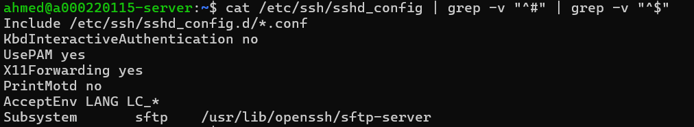
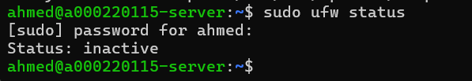
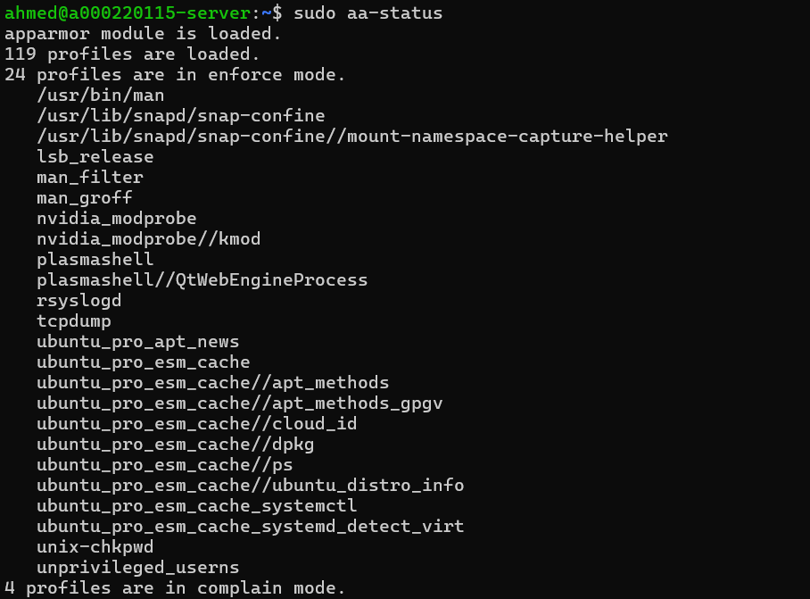
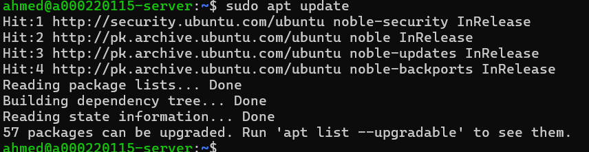

# Week 2: Security Planning and Testing Methodology

**Student:** Ahmed Hassan | **Student ID:** A00022015 | **Module:** CMPN202 Operating Systems

---

## 1. Performance Testing Plan

| Metric | Command | Purpose |
|--------|---------|---------|
| CPU | `top`, `htop` | Monitor processor usage |
| Memory | `free -h` | Track RAM usage |
| Disk | `iostat`, `df -h` | Measure disk I/O |
| Network | `iftop`, `ss` | Monitor connections |

All monitoring via SSH: `ssh ahmed@192.168.56.101`

---

## 2. Security Configuration Checklist

### Current System Status

### Checklist

| Security Control | Status | Week |
|-----------------|--------|------|
| SSH key-based auth | ❌ | Week 4 |
| Disable password login | ❌ | Week 4 |
| Enable UFW firewall | ❌ Inactive | Week 4 |
| AppArmor profiles | ✅ Active | Week 5 |
| fail2ban | ❌ | Week 5 |
| Auto-updates | ❌ | Week 5 |

---

## 3. Threat Model

| Threat | Risk | Mitigation |
|--------|------|------------|
| **SSH Brute Force** | High | SSH keys, fail2ban, firewall restrict IP |
| **Unauthorised Access** | Medium | UFW firewall, allow SSH only |
| **Privilege Escalation** | Medium | AppArmor, regular updates |

---

## 4. Reflection

**Learned:** Security assessment, threat modelling, defense in depth.

**Gaps Found:** Firewall inactive, password auth enabled, no intrusion detection.

---

*Week 2 Complete - Ahmed Hassan (A00022015)*