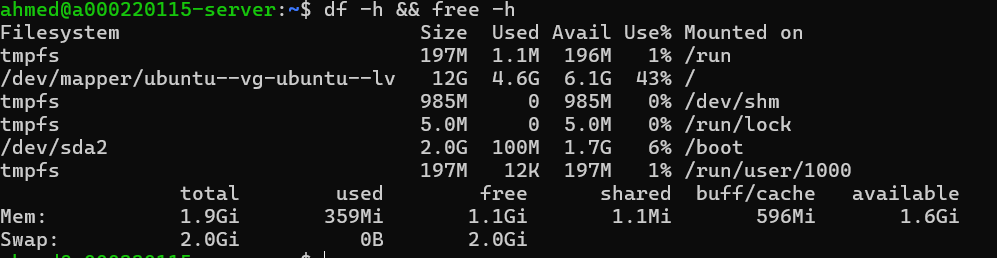
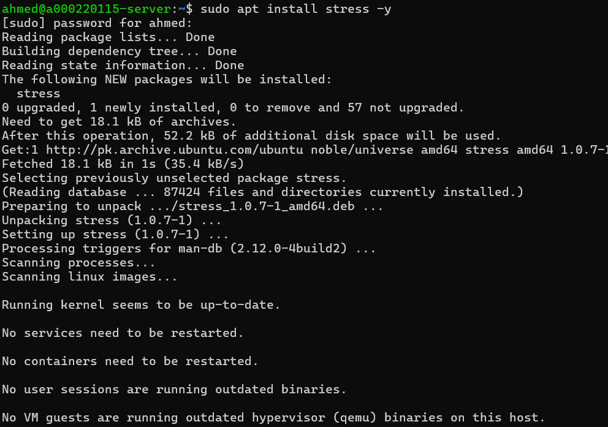
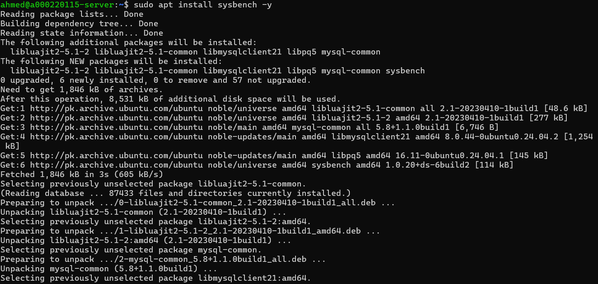
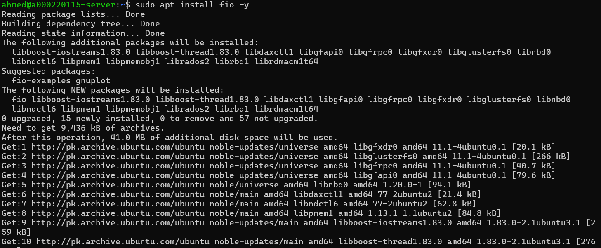
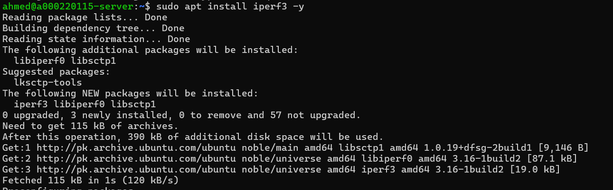
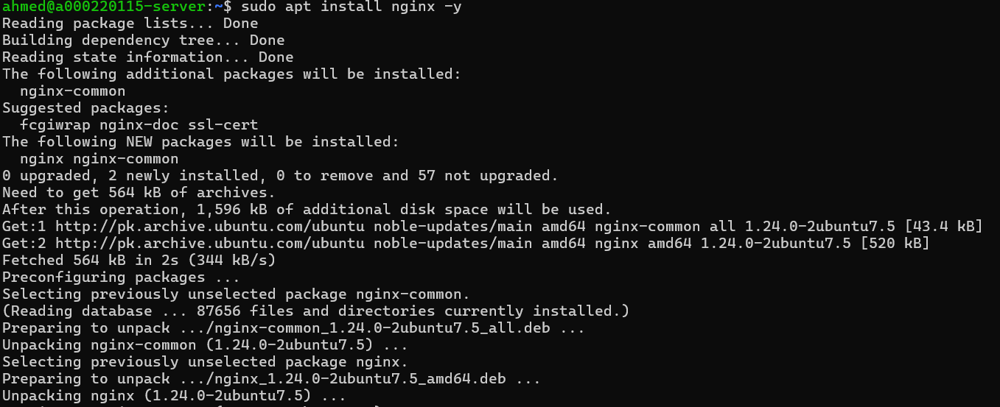
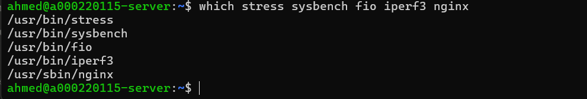

# Week 3: Application Selection for Performance Testing

**Student:** Ahmed Hassan | **Student ID:** A00022015 | **Module:** CMPN202 Operating Systems

---

## 1. Application Selection Matrix

| Workload Type | Application | Purpose |
|---------------|-------------|---------|
| **CPU-intensive** | stress | Generates CPU load for testing |
| **RAM-intensive** | stress | Can also stress test memory |
| **I/O-intensive** | fio | Flexible I/O tester for disk benchmarks |
| **Network-intensive** | iperf3 | Network bandwidth testing |
| **Server Application** | nginx | Web server for load testing |
| **Benchmarking** | sysbench | Multi-purpose benchmark tool |

---

## 2. Installation Documentation

### System Baseline


---

### Install stress (CPU/RAM Testing)
```bash
sudo apt install stress -y
```


---

### Install sysbench (Benchmarking)
```bash
sudo apt install sysbench -y
```


---

### Install fio (Disk I/O Testing)
```bash
sudo apt install fio -y
```


---

### Install iperf3 (Network Testing)
```bash
sudo apt install iperf3 -y
```


---

### Install nginx (Web Server)
```bash
sudo apt install nginx -y
```


---

### Verify Installations


---

## 3. Expected Resource Profiles

| Application | CPU | RAM | Disk I/O | Network |
|-------------|-----|-----|----------|---------|
| stress (CPU) | High | Low | Low | None |
| stress (RAM) | Low | High | Low | None |
| fio | Low | Medium | High | None |
| iperf3 | Low | Low | None | High |
| nginx | Low-Medium | Low | Low | Medium |
| sysbench | Varies | Varies | Varies | None |

---

## 4. Monitoring Strategy

| Metric | Command | When to Use |
|--------|---------|-------------|
| CPU usage | `top`, `htop` | During stress/sysbench tests |
| Memory usage | `free -h`, `vmstat` | During RAM tests |
| Disk I/O | `iostat`, `iotop` | During fio tests |
| Network | `iftop`, `ss` | During iperf3/nginx tests |
| Overall | `vmstat 1` | Real-time monitoring |

---

## 5. Reflection

**Learned:** Selected appropriate tools for each workload type to test server performance comprehensively.

**Next Steps:** Week 4 - Implement security controls (SSH hardening, firewall) before performance testing.

---

*Week 3 Complete - Ahmed Hassan (A00022015)*