# Week 4: Initial System Configuration & Security Implementation

**Student:** Ahmed Hassan | **Student ID:** A00022015 | **Module:** CMPN202 Operating Systems

---

## 1. SSH Configuration with Key-Based Authentication

### SSH Config (BEFORE)
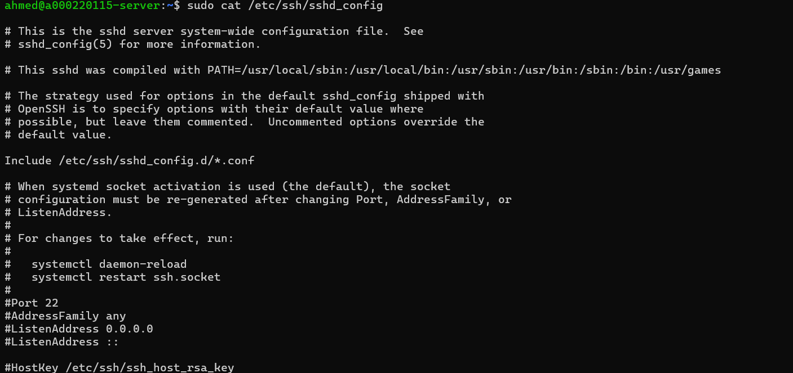

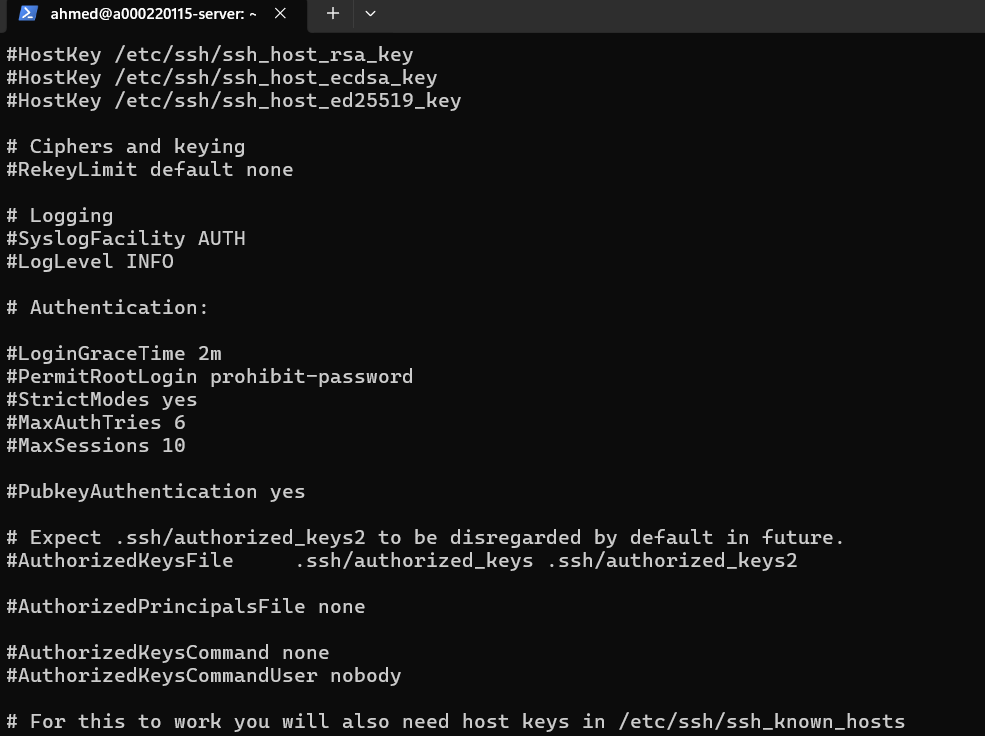

---

### Generate SSH Key (Windows)
```powershell
ssh-keygen -t ed25519 -C "ahmed@a00022015"
```
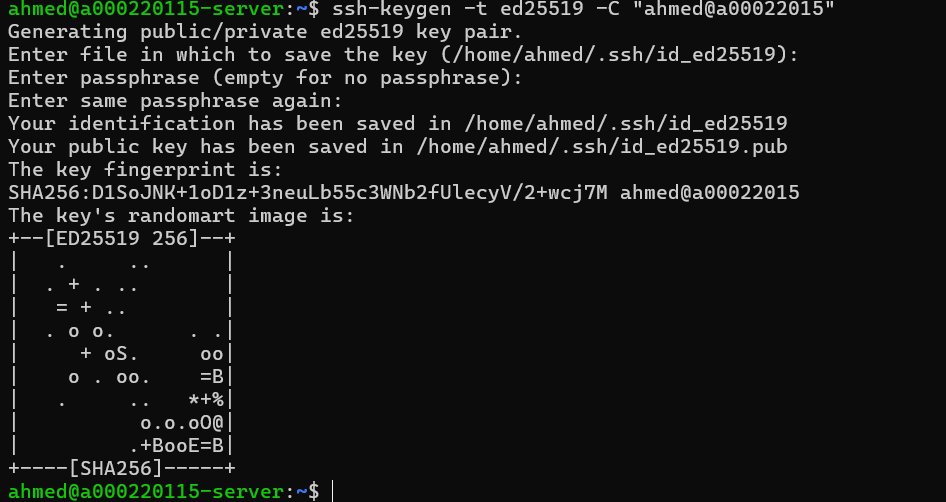

---

### View Public Key
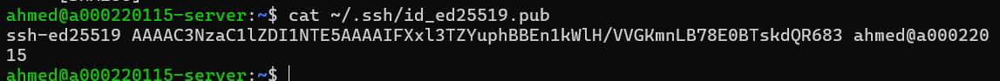

---

### Copy Key to Server
```powershell
ssh-copy-id ahmed@192.168.56.101
```
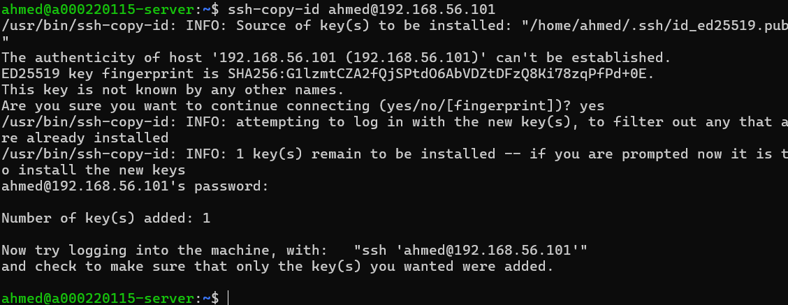

---

### Test Key-Based Login (No Password!)
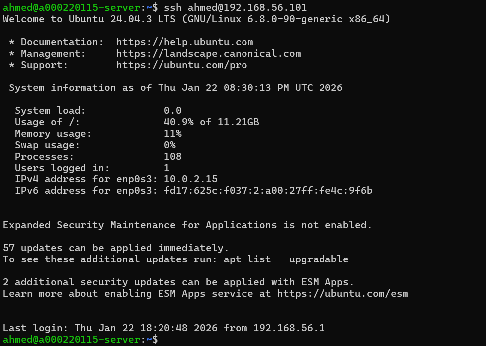

---

### SSH Config Edit
Added to `/etc/ssh/sshd_config`:
```
PermitRootLogin no
PasswordAuthentication no
PubkeyAuthentication yes
```
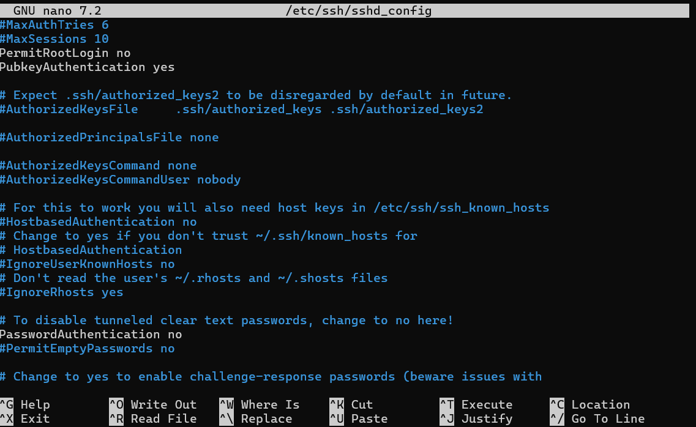

---

### SSH Config (AFTER)
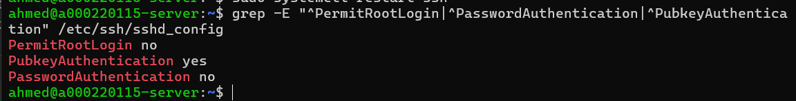

---

## 2. Firewall Configuration

### Firewall Status (BEFORE)
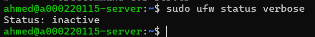

---

### Configure UFW Rules
```bash
sudo ufw allow from 192.168.56.1 to any port 22
sudo ufw default deny incoming
sudo ufw default allow outgoing
sudo ufw enable
```
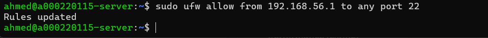

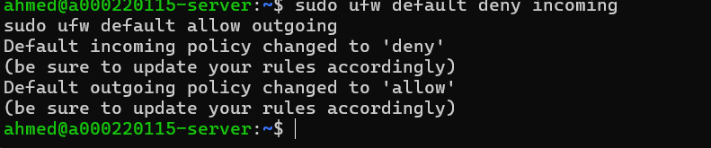


---

### Firewall Status (AFTER)
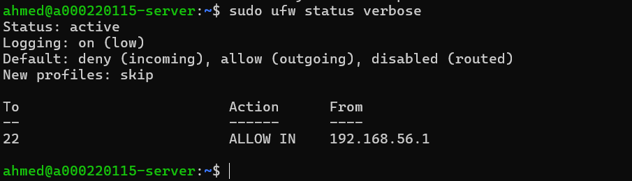

### Firewall Rules Summary

| Rule | Action | From |
|------|--------|------|
| Port 22 (SSH) | ALLOW | 192.168.56.1 only |
| All other incoming | DENY | Any |
| Outgoing | ALLOW | Any |

---

## 3. User Privilege Management

### Users (BEFORE)
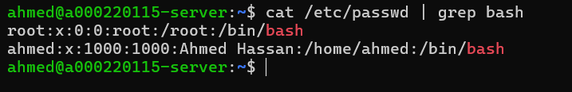

---

### Create Non-Root Admin User
```bash
sudo adduser sysadmin
sudo usermod -aG sudo sysadmin
```
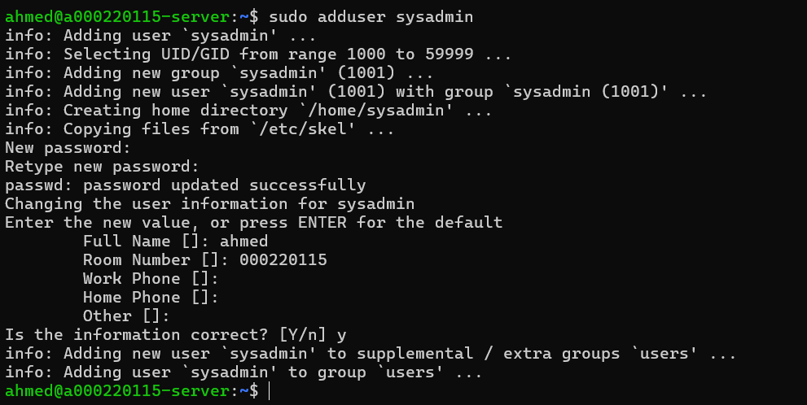

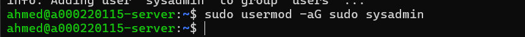

---

### Users (AFTER)
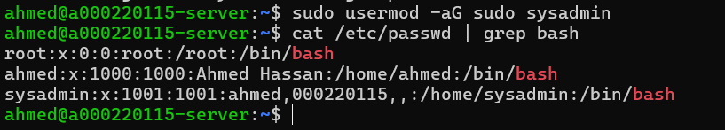

---

### Verify Sudo Access
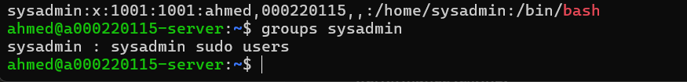

---

## 4. Security Summary

| Security Control | Status |
|-----------------|--------|
| SSH Key-Based Auth | ✅ Enabled |
| Password Auth Disabled | ✅ Disabled |
| Root Login Disabled | ✅ Disabled |
| UFW Firewall | ✅ Active |
| SSH Restricted to Workstation | ✅ 192.168.56.1 only |
| Non-Root Admin User | ✅ sysadmin created |

---

## 5. Reflection

**Learned:** SSH hardening, key-based authentication, UFW firewall configuration, user privilege management.

**Challenges:** Had to add settings at end of sshd_config file since defaults were commented.

---

*Week 4 Complete - Ahmed Hassan (A00022015)*
