# Week 5: Advanced Security and Monitoring Infrastructure

**Student:** Ahmed Hassan | **Student ID:** A00022015 | **Module:** CMPN202 Operating Systems

---

## 1. AppArmor Access Control

### AppArmor Status
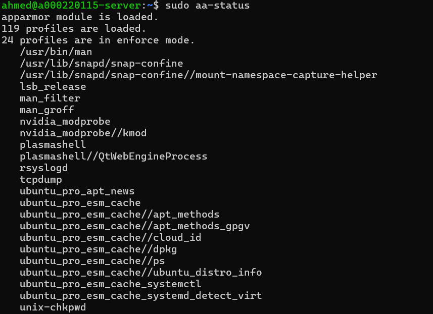

---

### AppArmor Profiles
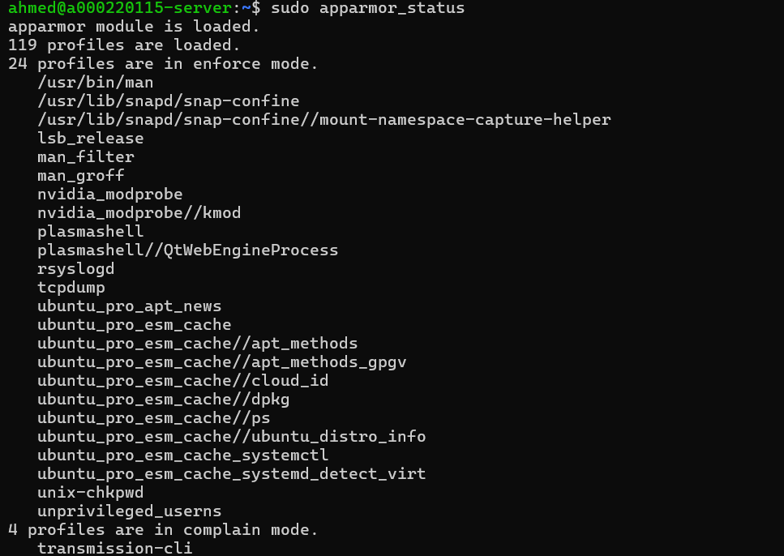

---

### Install AppArmor Utilities
```bash
sudo apt install apparmor-utils -y
```
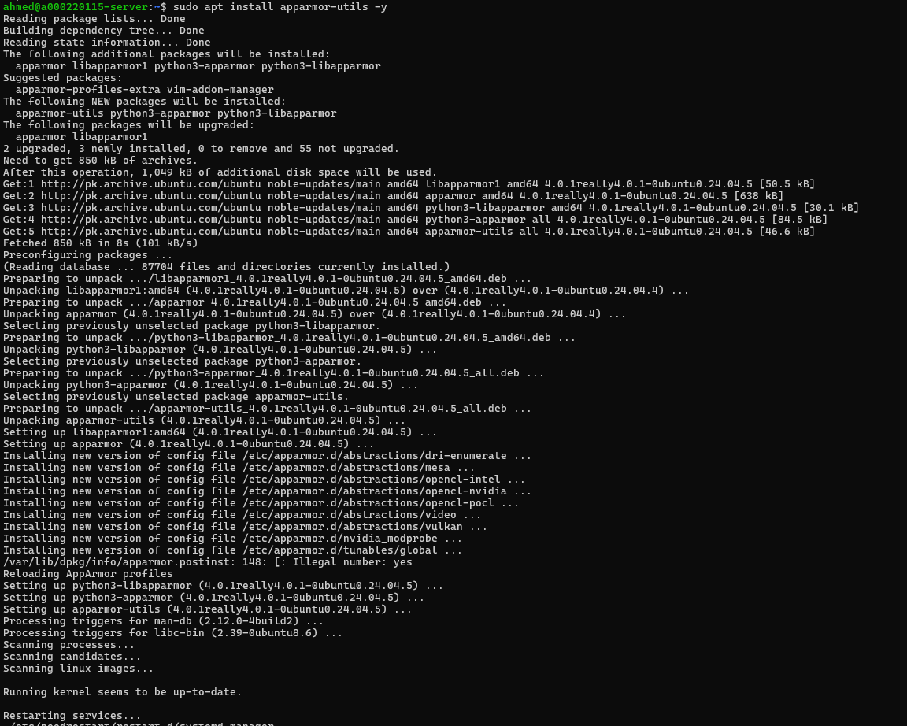

---

## 2. Automatic Security Updates

### Install Unattended Upgrades
```bash
sudo apt install unattended-upgrades -y
```
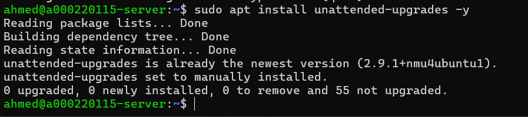

---

### Enable Automatic Updates
```bash
sudo dpkg-reconfigure unattended-upgrades --priority=low
```
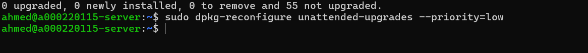

---

### Verify Configuration
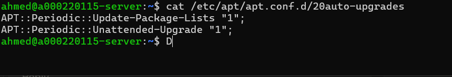

---

## 3. fail2ban Intrusion Detection

### Install fail2ban
```bash
sudo apt install fail2ban -y
```
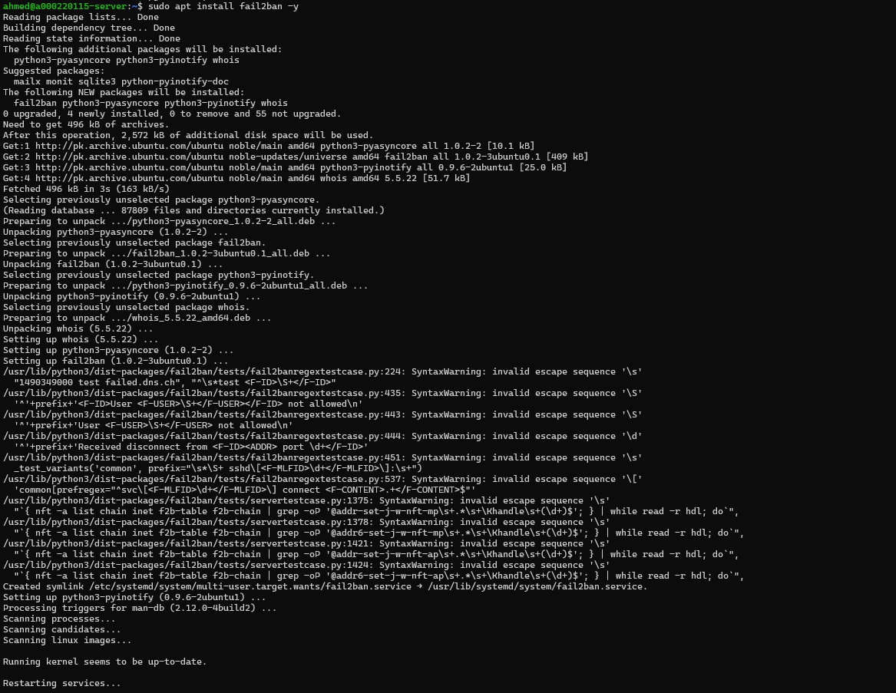

---

### Enable fail2ban
```bash
sudo systemctl start fail2ban
sudo systemctl enable fail2ban
```
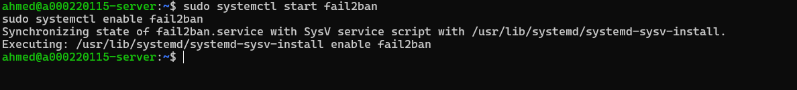

---

### fail2ban Status
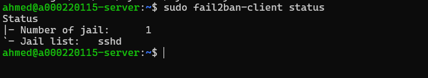

---

### SSH Jail Status
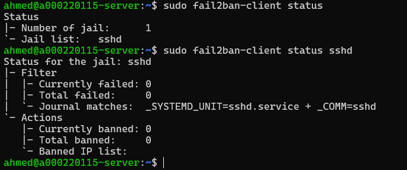

---

## 4. Security Baseline Script (security-baseline.sh)

### Script Code
```bash
#!/bin/bash
# security-baseline.sh
# Purpose: Verify all security configurations from Weeks 4 and 5
# Author: Ahmed Hassan (A00022015)

echo "=========================================="
echo "  Security Baseline Verification Script"
echo "=========================================="

# Check SSH Configuration
echo "[1] Checking SSH Configuration..."
ROOT_LOGIN=$(grep "^PermitRootLogin" /etc/ssh/sshd_config)
PASS_AUTH=$(grep "^PasswordAuthentication" /etc/ssh/sshd_config)
PUBKEY=$(grep "^PubkeyAuthentication" /etc/ssh/sshd_config)

# Check Firewall Status
echo "[2] Checking Firewall Status..."
sudo ufw status verbose

# Check AppArmor Status
echo "[3] Checking AppArmor Status..."
sudo aa-status | head -10

# Check fail2ban Status
echo "[4] Checking fail2ban Status..."
sudo fail2ban-client status

# Check Automatic Updates
echo "[5] Checking Automatic Updates..."
cat /etc/apt/apt.conf.d/20auto-upgrades

# Check Users with Sudo Access
echo "[6] Checking Sudo Users..."
grep -Po '^sudo.+:\K.*$' /etc/group

echo "=========================================="
echo "  Security Baseline Check Complete"
echo "=========================================="
```

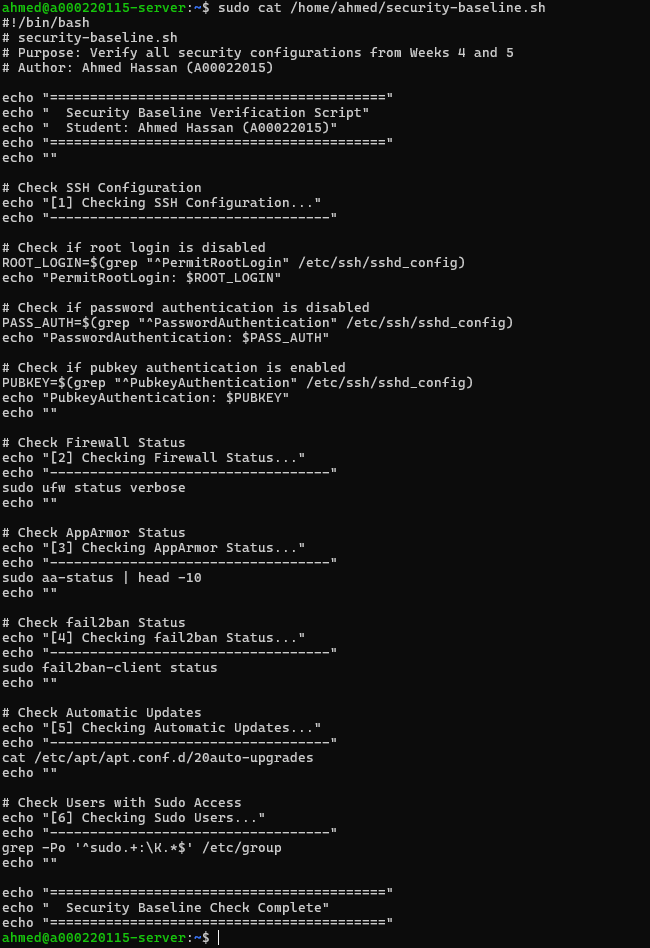

---

### Script Output
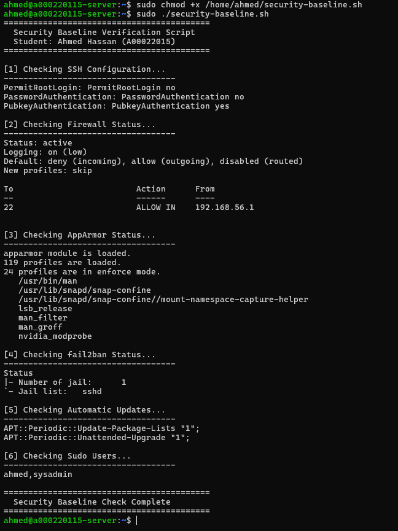

---

## 5. Remote Monitoring Script (monitor-server.sh)

### Script Code
```bash
#!/bin/bash
# monitor-server.sh
# Purpose: Collect performance metrics from the server
# Author: Ahmed Hassan (A00022015)

echo "=========================================="
echo "  Server Monitoring Script"
echo "=========================================="

# CPU Usage
echo "[1] CPU Usage..."
top -bn1 | head -5

# Memory Usage
echo "[2] Memory Usage..."
free -h

# Disk Usage
echo "[3] Disk Usage..."
df -h | grep -E "^/dev"

# Network Connections
echo "[4] Network Connections..."
ss -tuln | head -10

# System Uptime and Load
echo "[5] System Load..."
uptime

# Running Services
echo "[6] Running Services..."
systemctl list-units --type=service --state=running | head -10

echo "=========================================="
echo "  Monitoring Complete"
echo "=========================================="
```

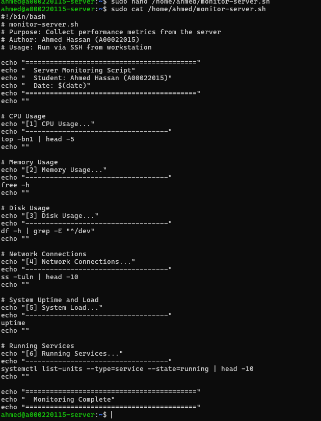

---

### Script Output


---

## 6. Security Summary

| Security Control | Status |
|-----------------|--------|
| AppArmor | ✅ Active |
| Automatic Updates | ✅ Enabled |
| fail2ban | ✅ Running |
| security-baseline.sh | ✅ Created |
| monitor-server.sh | ✅ Created |

---

## 7. Reflection

**Learned:** AppArmor configuration, automatic updates setup, fail2ban intrusion detection, bash scripting with comments.

**Scripts Created:** Two scripts for security verification and performance monitoring, both with line-by-line comments.

---

*Week 5 Complete - Ahmed Hassan (A00022015)*