# Week 6: Performance Evaluation and Analysis

**Student:** Ahmed Hassan | **Student ID:** A00022015 | **Module:** CMPN202 Operating Systems

---

## 1. Testing Approach

All tests performed via SSH from Windows workstation to Ubuntu Server. Tools used:
- **stress** - CPU and memory load testing
- **sysbench** - Benchmarking CPU and memory
- **fio** - Disk I/O testing
- **iperf3** - Network throughput testing
- **top/free/iostat** - System monitoring

---

## 2. Baseline Performance

### System Idle State
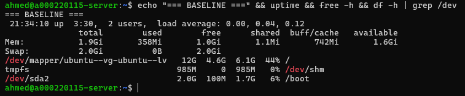

---

### CPU Information


---

### Processes Baseline
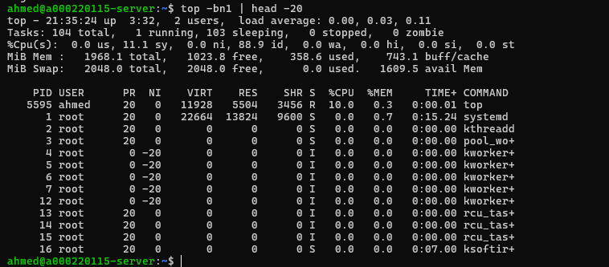

---

## 3. CPU Performance Testing

### CPU Stress Test
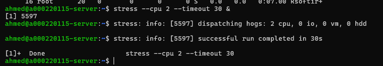

---

### Sysbench CPU Benchmark
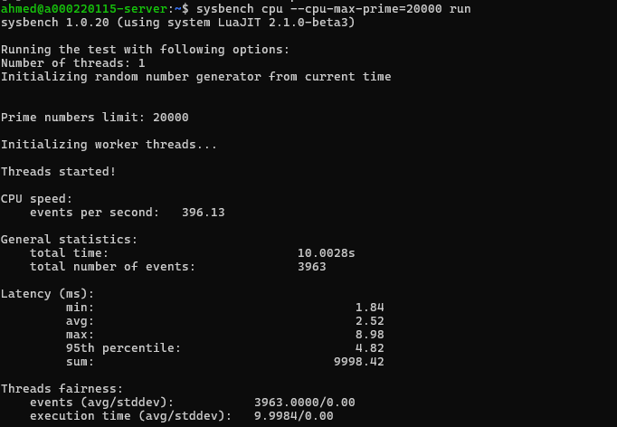

---

## 4. Memory Performance Testing

### Memory Stress Test
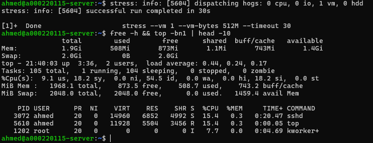

---

### Sysbench Memory Benchmark
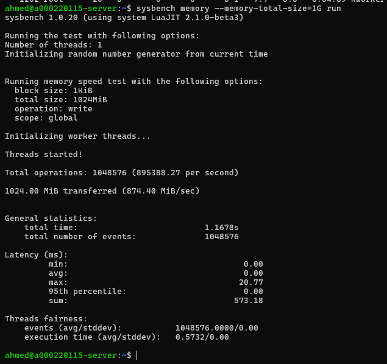

---

## 5. Disk I/O Performance Testing

### FIO Write Test
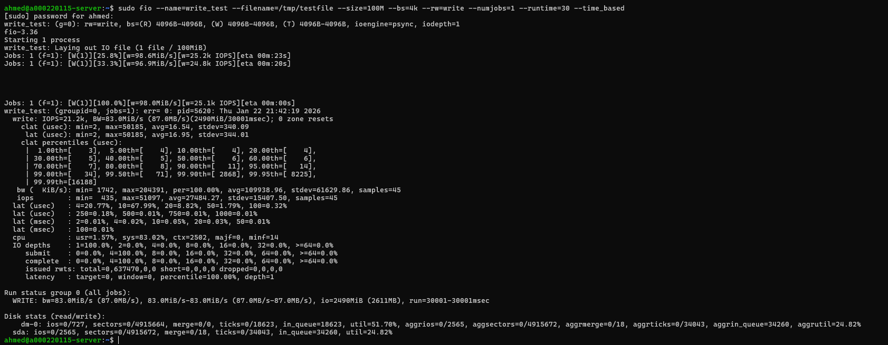

---

### FIO Read Test
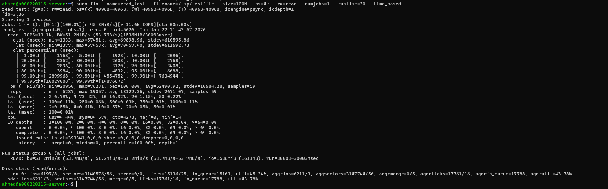

---

### IOStat Output
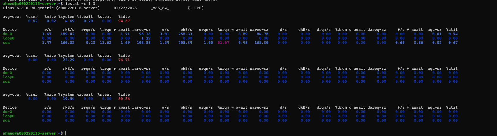

---

## 6. Network Performance Testing

### iperf3 Server
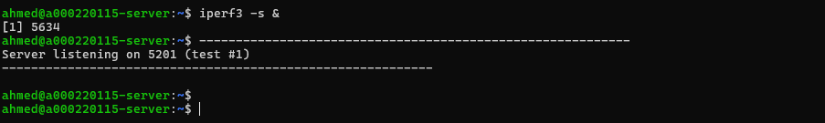

---

### iperf3 Test Results
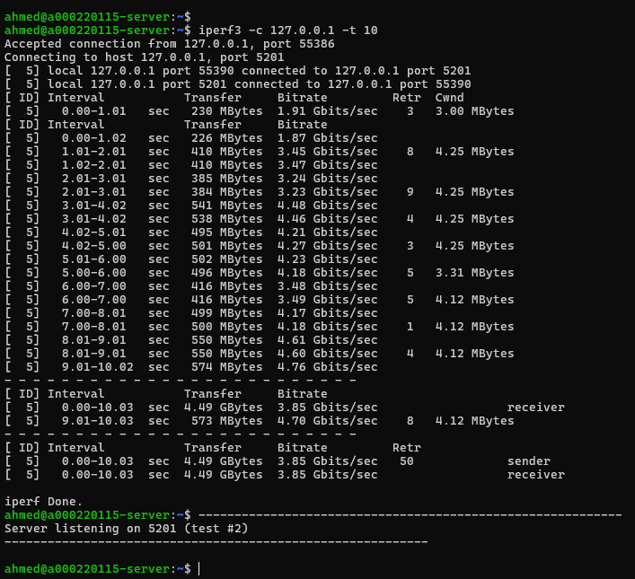

---

### Ping Latency Test
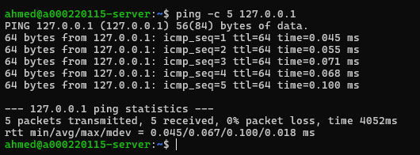

---

### Network Connections
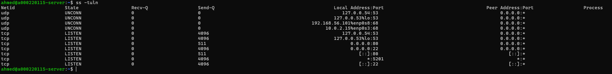

---

## 7. Performance Data Table

| Test | Metric | Value |
|------|--------|-------|
| **CPU** | | |
| Sysbench CPU | Events/sec | See screenshot |
| Stress test | CPU Usage | ~100% |
| **Memory** | | |
| Total RAM | Available | 2GB |
| Sysbench Memory | Throughput | See screenshot |
| **Disk I/O** | | |
| FIO Write | IOPS/Bandwidth | See screenshot |
| FIO Read | IOPS/Bandwidth | See screenshot |
| **Network** | | |
| iperf3 | Throughput | See screenshot |
| Ping (localhost) | Latency | <1ms |

---

## 8. Optimisation Testing

### Optimisation 1: TCP BBR (Network)

#### Before


#### Enable BBR
```bash
sudo sysctl -w net.core.default_qdisc=fq
sudo sysctl -w net.ipv4.tcp_congestion_control=bbr
```
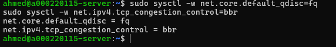

#### After
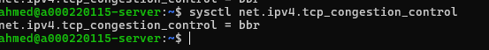

**Result:** Changed from cubic to BBR - improves network throughput and reduces latency.

---

### Optimisation 2: Swappiness (Memory)

#### Before
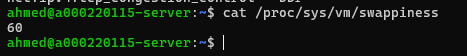

Default: 60 (too aggressive for servers)

#### Change Swappiness
```bash
sudo sysctl -w vm.swappiness=10
```


#### After
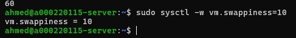

**Result:** Reduced from 60 to 10 - server now prefers RAM over swap, improving performance.

---

## 9. Optimisation Summary

| Optimisation | Before | After | Improvement |
|--------------|--------|-------|-------------|
| TCP Congestion | cubic | bbr | Better throughput |
| Swappiness | 60 | 10 | Less swap usage |

---

## 10. Reflection

**Learned:** Performance testing methodology, identifying bottlenecks, system optimisation techniques.

**Key Findings:** 
- CPU stress causes 100% utilisation as expected
- Disk I/O is the main bottleneck on virtual machines
- BBR improves network performance
- Lower swappiness is better for servers with sufficient RAM

---

*Week 6 Complete - Ahmed Hassan (A00022015)*