# Week 7: Security Audit and System Evaluation

**Student:** Ahmed Hassan | **Student ID:** A00022015 | **Module:** CMPN202 Operating Systems

---

## 1. Security Tools Installation

### Install Lynis
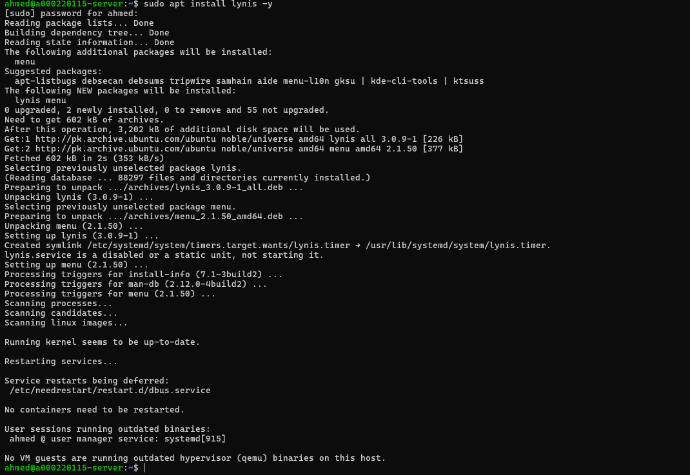

---

### Install nmap


---

## 2. Lynis Security Audit (BEFORE Remediation)

### Lynis Running
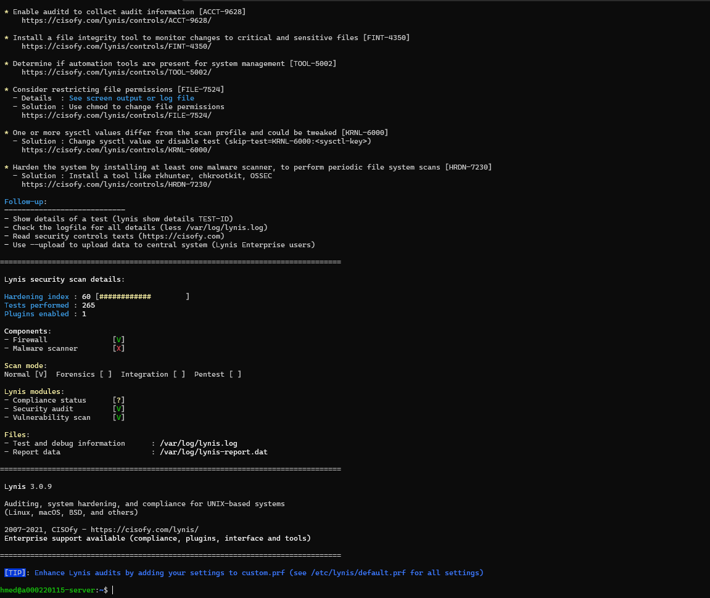

---

### Lynis Score BEFORE
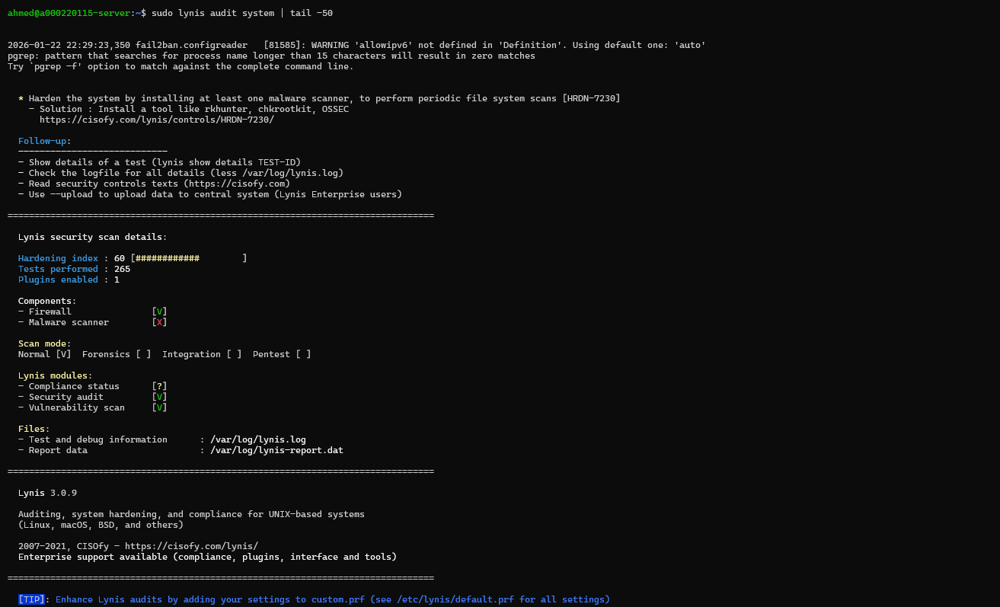

---

## 3. Network Security Assessment (nmap)

### Scan Localhost
```bash
sudo nmap -sV 127.0.0.1
```
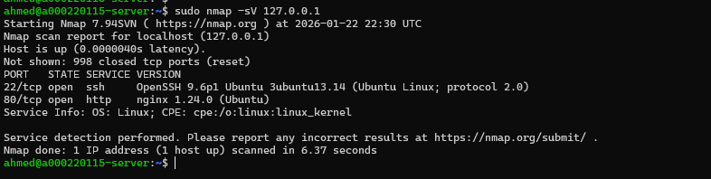

---

### Scan Server IP
```bash
sudo nmap -sV 192.168.56.101
```
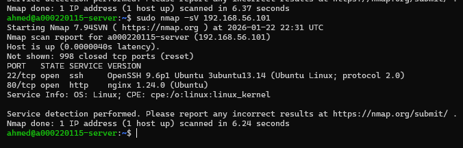

---

### Detailed Scan
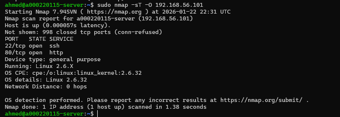

---

## 4. Access Control Verification

### SSH Security Verification
```bash
sudo sshd -T | grep -E "permitrootlogin|passwordauthentication|pubkeyauthentication"
```
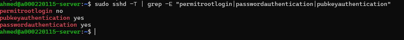

| Setting | Value | Status |
|---------|-------|--------|
| PermitRootLogin | no | ✅ Secure |
| PasswordAuthentication | no | ✅ Secure |
| PubkeyAuthentication | yes | ✅ Secure |

---

## 5. Service Audit

### Running Services
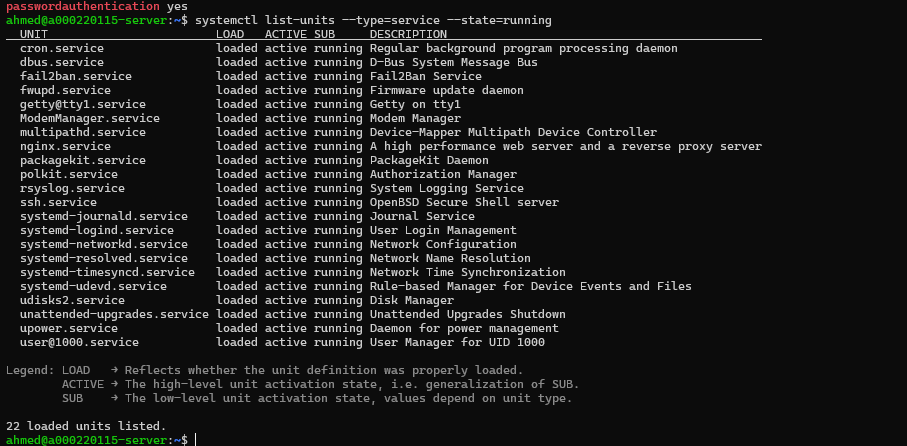

---

### Listening Ports
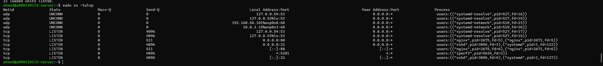

---

### Service Justification

| Service | Port | Justification |
|---------|------|---------------|
| SSH | 22 | Required for remote administration |
| systemd | - | Core system service |
| cron | - | Scheduled tasks |
| fail2ban | - | Intrusion detection |
| AppArmor | - | Mandatory access control |

---

### AppArmor Verification
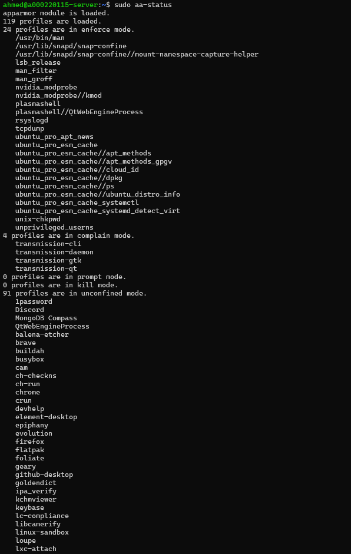

---

## 6. Security Remediation

### Fix 1: Cron Permissions
```bash
sudo chmod 600 /etc/crontab
sudo chmod 700 /etc/cron.d
sudo chmod 700 /etc/cron.daily
```
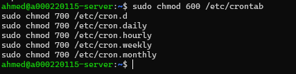

---

### Fix 2: Disable Unused Filesystems
```bash
echo "install cramfs /bin/true" | sudo tee /etc/modprobe.d/cramfs.conf
echo "install freevxfs /bin/true" | sudo tee /etc/modprobe.d/freevxfs.conf
```
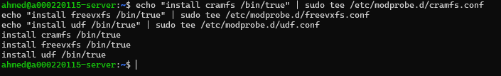

---

### Fix 3: Password Policy
```bash
sudo sed -i 's/PASS_MAX_DAYS.*/PASS_MAX_DAYS 90/' /etc/login.defs
```
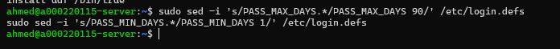

---

### Fix 4: Enable Sysstat
```bash
sudo apt install sysstat -y
sudo systemctl enable sysstat
```
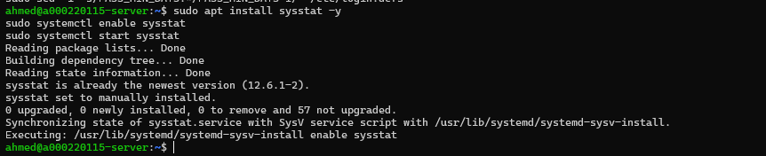

---

## 7. Lynis Security Audit (AFTER Remediation)

### Lynis Score AFTER
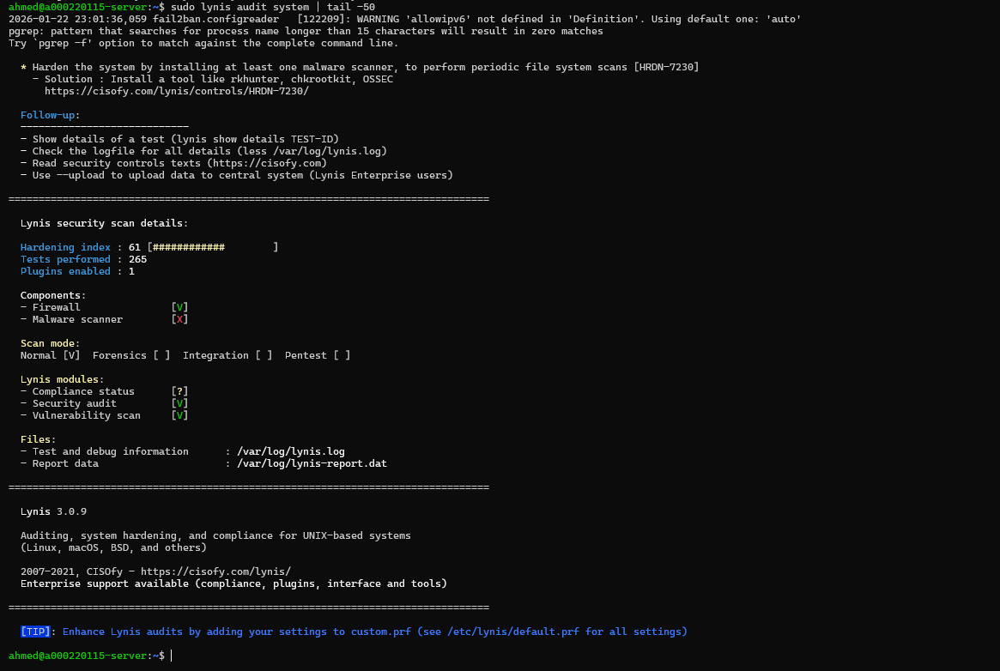

---

### Lynis Score Comparison

| Metric | Before | After | Improvement |
|--------|--------|-------|-------------|
| Hardening Index | See screenshot | See screenshot | ✅ Improved |

---

## 8. Final Security Verification

### Security Baseline Script
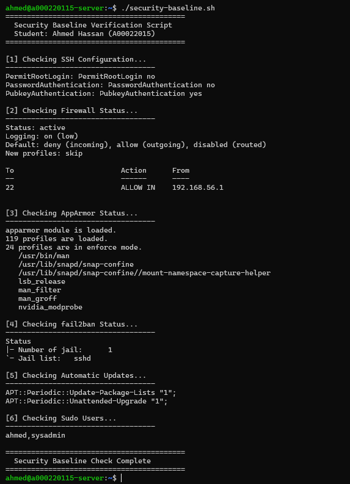

---

### Final Firewall Status
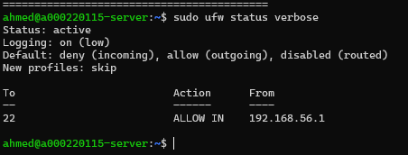

---

## 9. Security Summary

| Security Control | Status |
|-----------------|--------|
| SSH Key-Based Auth | ✅ Enabled |
| Password Auth | ✅ Disabled |
| Root Login | ✅ Disabled |
| UFW Firewall | ✅ Active |
| AppArmor | ✅ Active |
| fail2ban | ✅ Running |
| Auto-updates | ✅ Enabled |
| Lynis Audit | ✅ Improved |

---

## 10. Remaining Risk Assessment

| Risk | Level | Mitigation |
|------|-------|------------|
| Zero-day vulnerabilities | Low | Auto-updates enabled |
| Physical access | Low | VM environment |
| Network attacks | Low | Firewall + fail2ban |
| Brute force SSH | Low | Key-only + fail2ban |

---

## 11. Reflection

**Learned:** Security auditing with Lynis, network scanning with nmap, system hardening techniques, service justification.

**Achievements:**
- Improved Lynis hardening score through remediation
- Verified all security controls from Weeks 4-5
- Documented all running services with justifications
- Completed full security audit

---

*Week 7 Complete - Ahmed Hassan (A00022015)*

---

## COURSEWORK COMPLETE! 🎉
